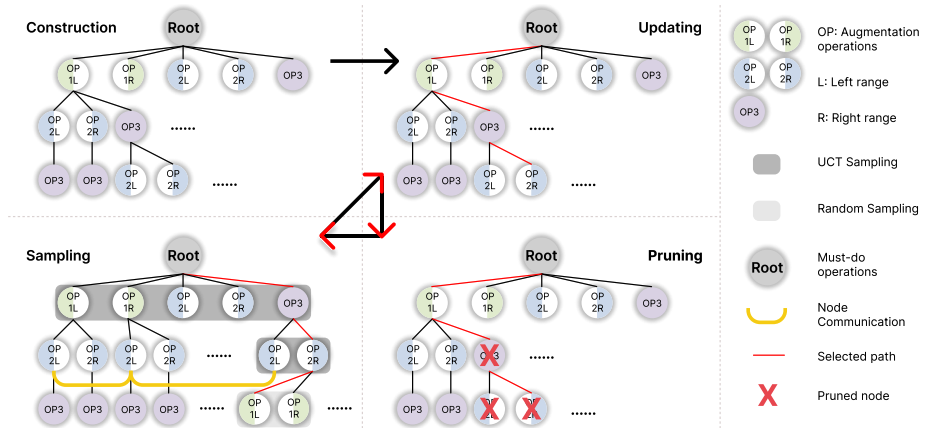
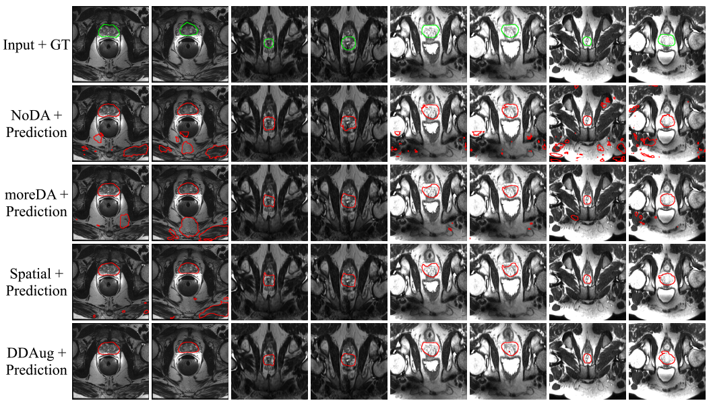

# Dynamic Data Augmentation via Monte-Carlo Tree Search for Prostate MRI Segmentation

This is the official implementation of ICONIP 2023: [Dynamic Data Augmentation via MCTS for Prostate MRI Segmentation](https://arxiv.org/abs/2305.15777).


## Download Original Data 

- [A Multi-site Dataset for Prostate MRI Segmentation](https://liuquande.github.io/SAML/) (Subset 1-6)

- [nnUNet Prostate MRI dataset](https://github.com/MIC-DKFZ/nnUNet/tree/master) (Subset 7)

## Format Data 

<!-- create folder structure -->

<!-- Please follow [nnUNet folder structure](https://github.com/MIC-DKFZ/nnUNet/blob/master/documentation/dataset_format.md) to ensure your data is in the expected layout.  -->

<!-- export paths, nnUNet_raw_data_base, nnUNet_preprocessed, RESULTS_FOLDER-->

<!-- mention folder strucutre, and use nnUNet_plan_and_preprocess -t to do it -->

## Requirements

```
pip install -r requirements.txt
```


## Training 

<!-- for fold in 0 1 2 3 4; do CUDA_VISIBLE_DEVICES=1 nnUNet_train 3d_fullres nnUNetTrainerV2_MCTS Task072_Prostate_HK $fold --npz; done;  -->

## Testing 

<!-- nnunet/inference/summarize_val_folds.py -->

## Result Visualization



<!-- 

result_folder = "/mnt/SSD_RAID/data/MedNAS/train_logs/nnUNet/3d_fullres"

for each_task in sorted(os.listdir(result_folder)):
    print("-" * 100)
    task_dir = f"{result_folder}/{each_task}"
    for each_model in sorted(os.listdir(task_dir)):
        model_dir = f"{task_dir}/{each_model}"

        table = pd.DataFrame()
        normal_exit = False
        for fold in range(5):
            each_fold = f"fold_{fold}"
            if not os.path.isfile(f"{model_dir}/{each_fold}/testing/result.csv"):
                continue
            fold_result = pd.read_csv(f"{model_dir}/{each_fold}/testing/result.csv", index_col=0).drop(
                index=["mean", "std"]
            )
            table = pd.concat([table, fold_result])
        else:
            normal_exit = True
            # normal exit
            mean_all = pd.DataFrame(
                data=[table.mean(axis=0).to_numpy()], columns=table.columns, index=["mean"]
            )
            std_all = pd.DataFrame(data=[table.std(axis=0).to_numpy()], columns=table.columns, index=["std"])
            table = pd.concat([table, mean_all, std_all])
            table.to_csv(f"{model_dir}/fold_summary.csv")
            print(f'out csv [{table.shape}] -> {each_task} {each_model.split("__")[0]}')
            print(mean_all.to_string())

        if not normal_exit:
            print(f'failed with -> {each_task} {each_model.split("__")[0]}')
        print("\n-----\n")

 -->

## Acknowledgement


## Citation
